# Making and using bathymetric maps with marmap2: extended tutorial

## Introduction

`marmap2` provides tools for importing, transforming and plotting
bathymetric and hypsometric data in R. It keeps the main workflow close
to modern R habits: data are returned as tidy long tables by default,
can be manipulated with pipes, and can be plotted with ggplot2.
Compatibility with the historical `bathy` matrix format is still
available when older marmap code needs it.

In this vignette, we will download bathymetric grids, inspect and
simplify them, build maps one layer at a time, compare bathymetric
colour scales, work around the Pacific antimeridian, project a
Mediterranean grid, regularise irregularly spaced soundings, and convert
bathymetric data to other spatial formats.

## A Quick Tutorial

The examples below use several regions with contrasted topography and
bathymetry: the Alboran Sea, the Mediterranean Sea, the Aleutian arc and
a set of irregularly spaced Hudson Bay soundings. The download commands
are shown exactly as they would be used in an interactive R session.

``` r
library(marmap2)
library(ggplot2)
```

### Getting Data Into R

The simplest way to get data into `marmap2` is to request a geographic
window from either [GEBCO](https://www.gebco.net) or
[NOAA](https://www.ngdc.noaa.gov/mgg/bathymetry/bathymetry.html). GEBCO
currently returns its native 15 arc-second grid. This is a good source
when a detailed local map is needed.

``` r
alboran <- get_gebco(
  lon = c(-6, 0),
  lat = c(35, 37)
)
```

For detailed maps covering limited areas, NOAA data can be loaded at a
resolution comparable to GEBCO. For maps covering large geographic
extents, the `resolution` argument of `get_noaa()` can be used to
request a coarser grid and avoid (down)loading unnecessarily large
datasets. The `resolution` argument is expressed in arc-minutes. The
highest resolutions are obtained with `resolution = 0.25` (0.25
arc-minutes, equivalent to 15 arc-seconds).

``` r
medit <- get_noaa(
  lon = c(-6, 36.5),
  lat = c(30, 46),
  resolution = 4
)
```

Both `get_gebco()` and `get_noaa()` provide a `keep` argument to store a
local copy of the downloaded data in the working directory. This helps
avoid repeated requests to the NOAA and GEBCO servers when the same
dataset is used several times.

The workflow remains unchanged: when data are requested with either
function, the working directory is checked first. If the corresponding
dataset is already available locally, this copy is loaded directly;
otherwise, the data are downloaded from the online source. The directory
used to save and retrieve local files can be specified with the `path`
argument of both functions.

`summarise_bathy()` can be used to print useful information about the
imported data.

``` r
head(alboran)
# A tibble: 6 × 3
    lon   lat depth
  <dbl> <dbl> <dbl>
1 -6.00  37.0     6
2 -5.99  37.0     3
3 -5.99  37.0     2
4 -5.99  37.0     2
5 -5.98  37.0     8
6 -5.98  37.0    25

summarise_bathy(alboran)
Bathymetric data summary
  Class:      tbl_df/tbl/data.frame
  Dimensions: 1440 longitude x 480 latitude (691200 cells)
  Longitude:  5.998 W to 0.002083 W
  Latitude:   35 N to 37 N
  Resolution: 0.25 x 0.25 arc-minutes
  Depth:      -2746 to 2849 (mean -604.3, median -359)
  Missing:    0
  Memory:     15.8 Mb

summarise_bathy(medit)
Bathymetric data summary
  Class:      tbl_df/tbl/data.frame
  Dimensions: 637 longitude x 240 latitude (152880 cells)
  Longitude:  5.967 W to 36.47 E
  Latitude:   30.03 N to 45.97 N
  Resolution: 4.003 x 4.003 arc-minutes
  Depth:      -5043 to 3325 (mean -347.7, median 69.19)
  Missing:    0
  Memory:     3.5 Mb
```

If you have already downloaded a high-resolution grid but only need a
lighter object for mapping or computation, you can reduce the resolution
locally with `reduce_bathy_resolution()`. This is preferable to sending
repeated queries for the same area to a remote server. As in
get\_noaa(), the `resolution` argument is expressed in arc-minutes, and
the `method` argument specifies how values in the coarser grid are
derived from the finer grid: nearest-cell value (default), mean value,
or median value.

``` r
alboran_5 <- reduce_bathy_resolution(
  alboran,
  resolution = 5
)

summarise_bathy(alboran_5)
Bathymetric data summary
  Class:      tbl_df/tbl/data.frame
  Dimensions: 71 longitude x 23 latitude (1633 cells)
  Longitude:  5.956 W to 0.1229 W
  Latitude:   35.04 N to 36.88 N
  Resolution: 5 x 5 arc-minutes
  Depth:      -2720 to 1919 (mean -618.6, median -379)
  Missing:    0
  Memory:     39.4 Kb
```

Both `get_noaa()` and `get_gebco()` return a tibble by default. `class =
"bathy"` can be used to return a legacy bathy matrix. A tibble can also
be converted to a legacy bathy matrix with `tbl_to_bathy()` after
import.

``` r
alboran_bathy <- tbl_to_bathy(alboran)
class(alboran_bathy)
[1] "bathy"
```

### Plotting Bathymetric Data

A first map can be produced in one line. `quickplot_bathy()` is meant
for data inspection just after downloading or transforming a grid.

``` r
quickplot_bathy(alboran)
```

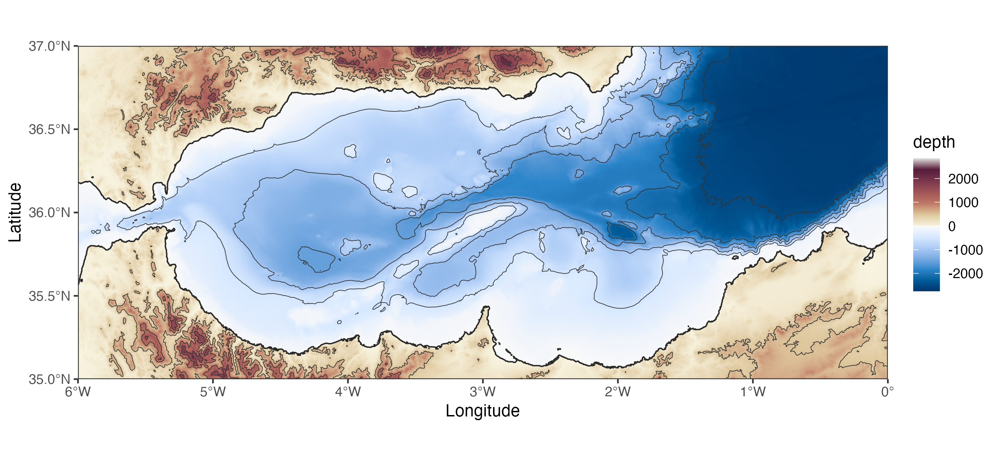

``` r
quickplot_bathy(alboran_5)
```


``` r
quickplot_bathy(medit)
```

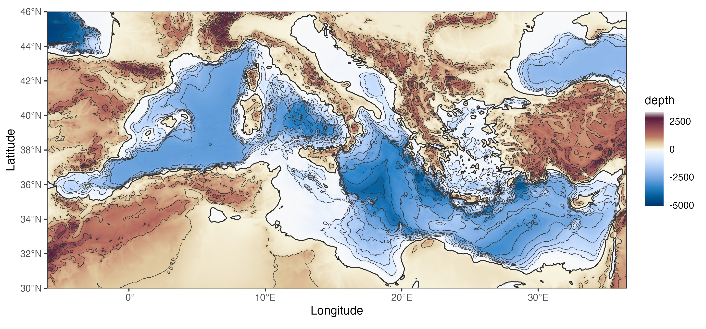

The same maps can be built layer by layer. `geom_bathy()` draws the
bathymetric raster, `geom_coastline()` draws the 0 m contour, and
`geom_contour()` can add isobaths and elevation contours. The manual
appraoch allows for finer control over the appearance of each layer and
the overall map. The example below shows a detailed map of the Alboran
Sea, with bathymetry, coastline, isobaths every hundred meters and
elevation contours every 500 meters.

``` r
alboran |>
  ggplot() +
  geom_bathy(expand = FALSE) +
  geom_coastline(linewidth = 0.45) +
  geom_contour(
    aes(lon, lat, z = depth),
    breaks = seq(0, -3000, by = -100),
    colour = "grey25",
    linewidth = 0.18
  ) +
  geom_contour(
    aes(lon, lat, z = depth),
    breaks = seq(0, 3000, by = 500),
    colour = "grey25",
    linewidth = 0.18
  ) +
  scale_fill_bathy(
    palette_ocean = "ocean_blues",
    palette_land = "land_hcl"
  ) +
  theme_bw()
```

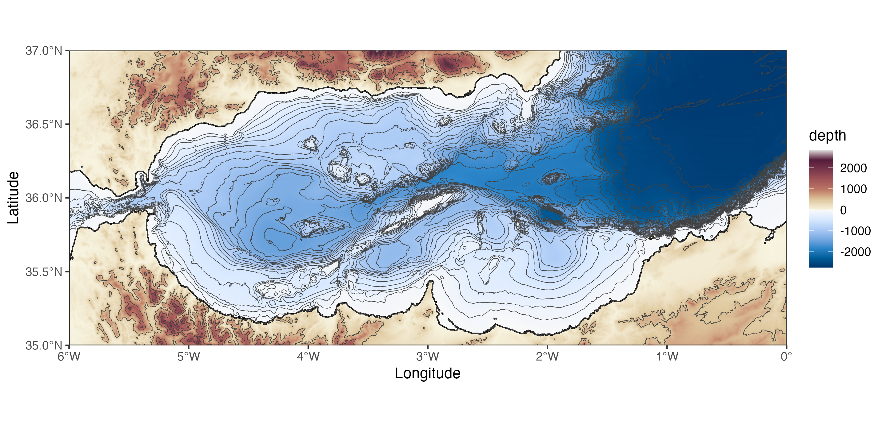

The palette system is deliberately simple: provide one palette for the
ocean and one for land. A palette can be one of the built-in names (try
`bathy_palettes()` for the full list), a vector of colours, a palette
function, or a single colour. This makes it possible to use the palettes
shipped with `marmap2`, palettes from other R packages, base R HCL
palettes, or hand-made gradients. The only important rule is to choose
ocean and land palettes that work together visually and remain ordered
from deep to shallow water, and from low to high elevation.

Here is the Alboran Sea with two palettes shipped with `marmap2`.

``` r
alboran |>
  ggplot() +
  geom_bathy(expand = FALSE) +
  geom_coastline(linewidth = 0.4) +
  scale_fill_bathy(
    palette_ocean = "ocean_mako",
    palette_land = "land_earth",
    mode = "rescale"
  ) +
  labs(title = "Built-in marmap2 palettes") +
  theme_bw()
```

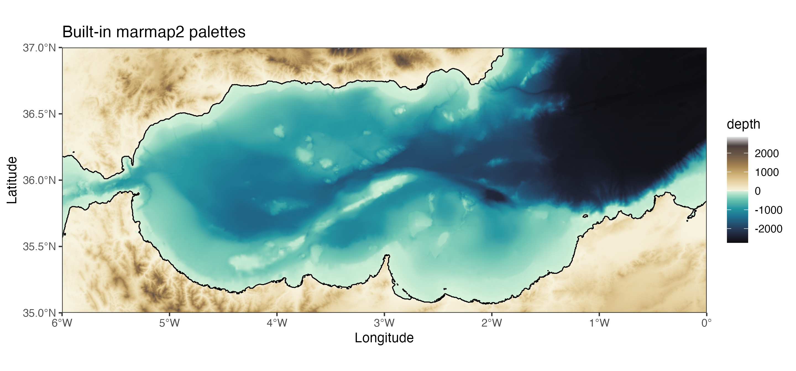

The same function can use colour-generating functions. The next example
uses base R HCL palettes through `grDevices::hcl.colors()`.

``` r
alboran |>
  ggplot() +
  geom_bathy(expand = FALSE) +
  geom_coastline(linewidth = 0.4) +
  scale_fill_bathy(
    palette_ocean = function(n) grDevices::hcl.colors(n, "Blues 3"),
    palette_land = function(n) grDevices::hcl.colors(n, "Terrain 2"),
    mode = "rescale"
  ) +
  labs(title = "Base R HCL palettes") +
  theme_bw()
```

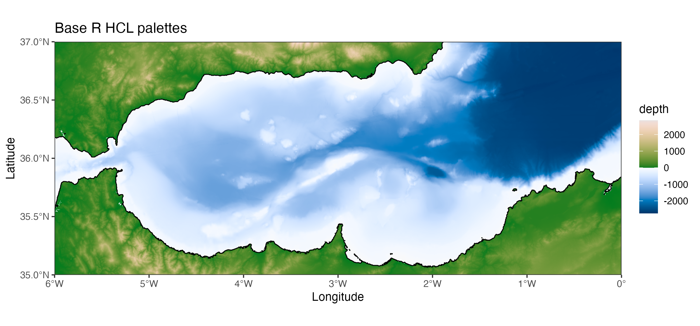

Palettes from other packages can be used in the same way. Here, a
viridis-style ocean palette is combined with a ColorBrewer land palette.

``` r
alboran |>
  ggplot() +
  geom_bathy(expand = FALSE) +
  geom_coastline(linewidth = 0.4) +
  scale_fill_bathy(
    palette_ocean = function(n) viridisLite::mako(n),
    palette_land = function(n) {
      grDevices::colorRampPalette(
        RColorBrewer::brewer.pal(9, "YlOrBr")
      )(n)
    },
    mode = "rescale"
  ) +
  labs(title = "viridisLite ocean and RColorBrewer land palettes") +
  theme_bw()
```

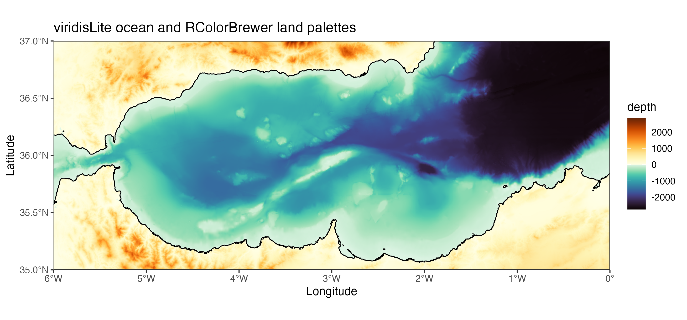

Finally, a palette can be created manually from colour vectors. This is
useful when preparing several figures that need a specific visual
identity.

``` r
alboran |>
  ggplot() +
  geom_bathy(expand = FALSE) +
  geom_coastline(linewidth = 0.4) +
  scale_fill_bathy(
    palette_ocean = c("#081D58", "#225EA8", "#41B6C4", "#C7E9B4", "#F7FCF0"),
    palette_land = c("#F6E8C3", "#D8B365", "#8C510A", "#4D2D17"),
    mode = "rescale"
  ) +
  labs(title = "Manual ocean and land gradients") +
  theme_bw()
```

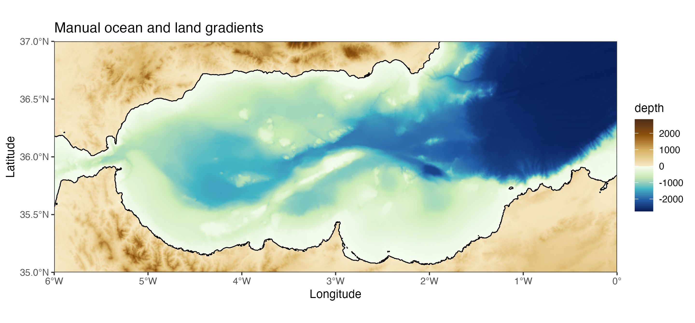

The `mode` argument controls how colours are assigned to depth and
elevation values. With `mode = "truncate"`, colours remain anchored to
fixed reference depths and elevations: the same depth keeps the same
colour across different maps. The reference can be supplied manually
with a numeric vector, or more simply with a bathymetric object through
the `reference_limits` argument. With `mode = "rescale"`, the complete
palette is stretched over the range of the plotted data, which maximises
local contrast but makes colours less directly comparable between maps.

The Mediterranean map below defines the regional reference. Because
`reference_limits = medit`, the complete palette is used across the
depth and elevation range of the Mediterranean dataset.

``` r
medit |>
  ggplot() +
  geom_bathy(expand = FALSE) +
  geom_coastline(linewidth = 0.35) +
  geom_contour(
    aes(lon, lat, z = depth),
    breaks = seq(0, -5000, by = -500),
    colour = "grey20",
    linewidth = 0.14
  ) +
  scale_fill_bathy(
    palette_ocean = "ocean_blues",
    palette_land = "land_earth",
    mode = "truncate",
    reference_limits = medit
  ) +
  labs(title = "Mediterranean Sea, regional reference") +
  theme_bw()
```

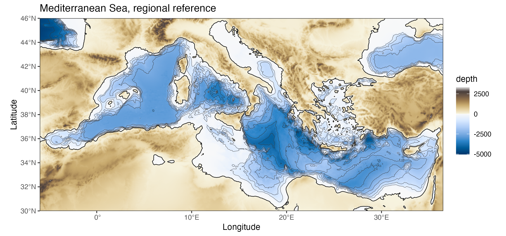

The two Alboran maps use the same palettes but different modes. In
truncate mode, the Alboran colours match the Mediterranean colours for
the same depths. In rescale mode, the full palette is used within the
local depth range of the Alboran Sea.

``` r
alboran |>
  ggplot() +
  geom_bathy(expand = FALSE) +
  geom_coastline(linewidth = 0.4) +
  geom_contour(
    aes(lon, lat, z = depth),
    breaks = seq(0, -3000, by = -250),
    colour = "grey20",
    linewidth = 0.16
  ) +
  scale_fill_bathy(
    palette_ocean = "ocean_blues",
    palette_land = "land_earth",
    mode = "truncate",
    reference_limits = medit
  ) +
  labs(title = "Alboran Sea, truncate mode, Mediterranean reference") +
  theme_bw()
```

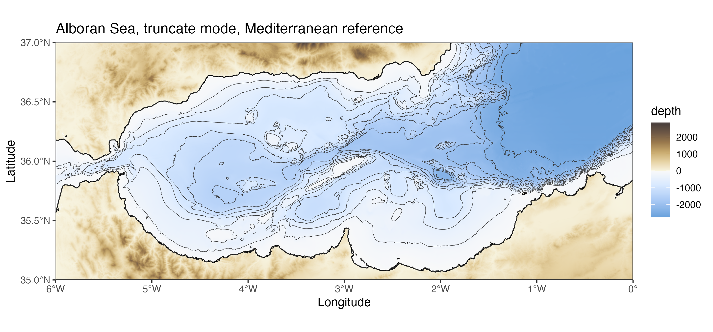

``` r
alboran |>
  ggplot() +
  geom_bathy(expand = FALSE) +
  geom_coastline(linewidth = 0.4) +
  geom_contour(
    aes(lon, lat, z = depth),
    breaks = seq(0, -3000, by = -250),
    colour = "grey20",
    linewidth = 0.16
  ) +
  scale_fill_bathy(
    palette_ocean = "ocean_blues",
    palette_land = "land_earth",
    mode = "rescale"
  ) +
  labs(title = "Alboran Sea, rescale mode") +
  theme_bw()
```

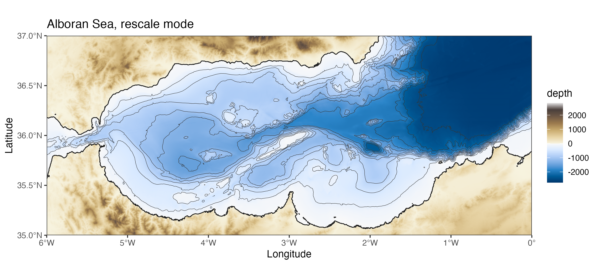

For a contour-only map, you can use `scale_colour_bathy()` with the
levels computed by `geom_contour()` to color code isobaths or elevation
contours. In the example below, `geom_bathy()` is still used to draw the
geographic background and land mask, but the ocean fill is made
transparent. The depth information is carried only by the contour lines.

``` r
alboran |>
  ggplot(aes(lon, lat, z = depth)) +
  geom_bathy(expand = FALSE, show.legend = FALSE) +
  geom_contour(
    aes(colour = after_stat(level)),
    breaks = seq(-2500, 0, by = 500),
    linewidth = 0.5
  ) +
  geom_coastline() +
  scale_fill_bathy(
    palette_ocean = "transparent",
    palette_land = "grey80",
    mode = "rescale",
    name = "depth"
  ) +
  scale_colour_bathy(
    palette_ocean = "ocean_blues",
    palette_land = NULL,
    mode = "rescale",
    name = "depth"
  ) +
  theme_bw()
```

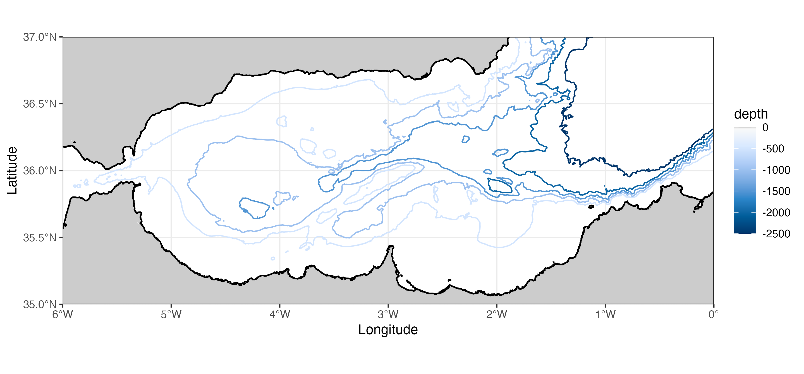

Here, `scale_fill_bathy()` controls the background only: ocean cells are
transparent and land cells are grey. `scale_colour_bathy()` controls the
isobaths. Setting `palette_land = NULL` tells the colour scale that only
ocean values should be mapped, so shallow negative depths are not
treated as land colours. `show.legend = FALSE` in `geom_bathy()` avoids
displaying a second legend for the transparent background layer.

### Preparing Maps In The Pacific Antimeridian Region

A region that crosses the antimeridian is best requested explicitly. For
example, the Aleutian arc spans longitudes east and west of 180 degrees.

``` r
aleutians <- get_noaa(
  lon = c(165, -145),
  lat = c(50, 65),
  resolution = 5,
  antimeridian = TRUE
)
```

When the data use continuous longitudes around 180 degrees, set
`antimeridian = TRUE` in `geom_bathy()`. The x axis then remains
readable, with labels expressed as east and west longitudes.

``` r
aleutians |>
  ggplot() +
  geom_bathy(
    aes(lon, lat, fill = depth),
    antimeridian = TRUE,
    expand = FALSE,
    x_breaks = seq(165, 215, by = 10)
  ) +
  geom_coastline(linewidth = 0.4) +
  geom_contour(
    aes(lon, lat, z = depth),
    breaks = seq(0, -7000, by = -500),
    colour = "grey20",
    linewidth = 0.15
  ) +
  scale_fill_bathy(
    palette_ocean = "ocean_blues",
    palette_land = "land_earth"
  ) +
  theme_bw()
```

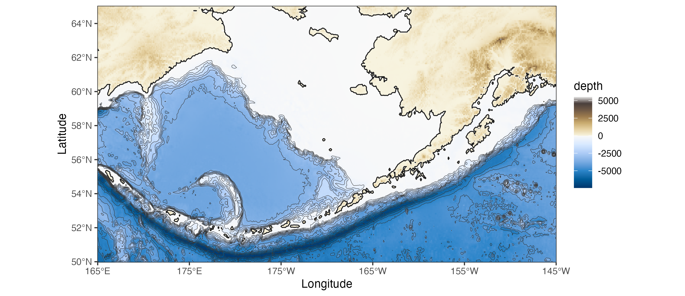

### Projections

Geographic longitude/latitude grids are convenient for downloading data,
but a projected coordinate reference system is often preferable for
regional maps. Here, a Mediterranean grid is downloaded from NOAA,
projected to ETRS89 / LAEA Europe (EPSG:3035), and plotted in one pipe.

``` r
medit <- get_noaa(
  lon = c(-6, 36.5),
  lat = c(30, 46),
  resolution = 4
)
```

``` r
medit |>
  project_bathy(
    crs_to = 3035,
  ) |>
  ggplot() +
  geom_bathy(expand = FALSE) +
  geom_coastline(linewidth = 0.35) +
  scale_fill_bathy(
    palette_ocean = "ocean_blues",
    palette_land = "land_earth"
  ) +
  labs(x = "Easting", y = "Northing") +
  theme_bw()
```

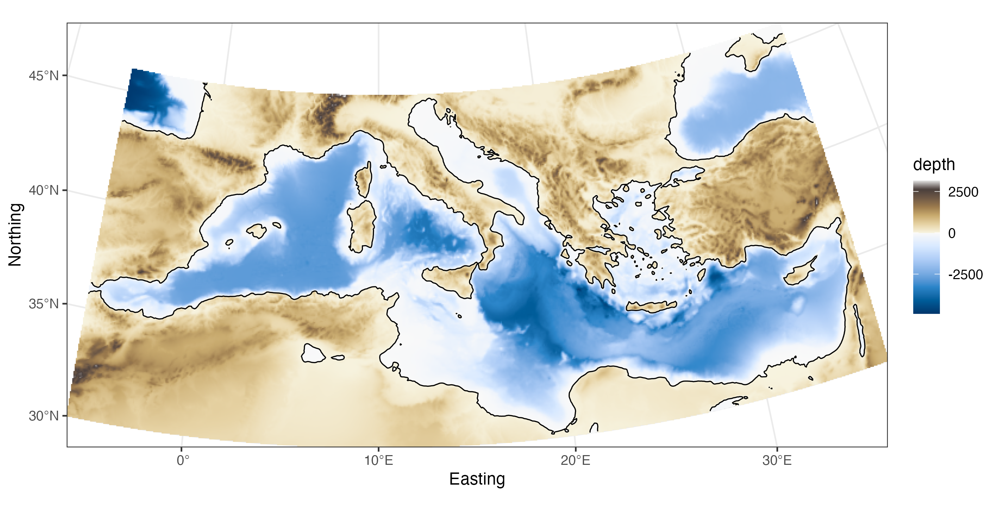

The visible grid is no longer a simple longitude/latitude rectangle: the
projection and raster resampling have changed the shape of the mapped
region.

### Irregularly Spaced Data

Bathymetric data are sometimes available as irregularly spaced soundings
rather than as a regular grid. `griddify()` bins these points into a
regular grid and, optionally, fills empty cells by inverse distance
weighting.

``` r
set.seed(1)
irregular_sample <- irregular[sample(nrow(irregular), 1600), ]

hudson <- griddify(
  irregular_sample,
  nlon = 90,
  nlat = 90,
  interpolate = TRUE
)

hudson |>
  ggplot() +
  geom_bathy(expand = FALSE) +
  geom_point(
    data = irregular_sample,
    aes(lon, lat),
    inherit.aes = FALSE,
    size = 0.25,
    alpha = 0.35
  ) +
  scale_fill_bathy(
    palette_ocean = "ocean_mako",
    palette_land = NULL,
    mode = "rescale",
    limits = c(min(hudson$depth, na.rm = TRUE), 0)
  ) +
  theme_bw()
```

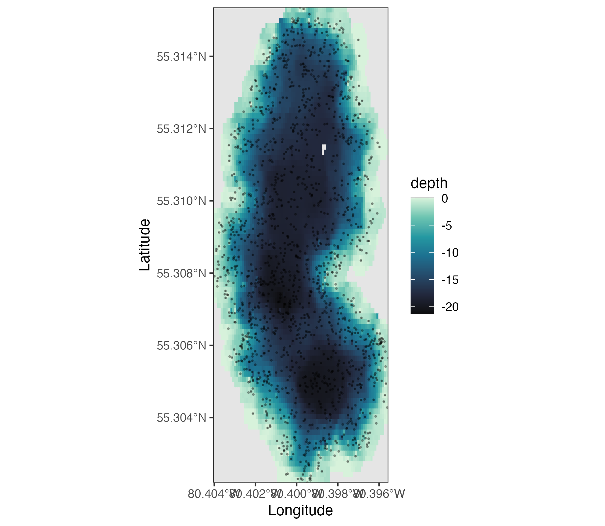

The points show the original sampling pattern. The background grid is
the regularised bathymetry returned by `griddify()` and can be passed to
all the same plotting and conversion functions as imported data.

### Other Spatial Formats

The default tibble format is convenient for ggplot2 and tidy workflows.
Other formats are available when needed.

``` r
alboran_bathy <- tbl_to_bathy(alboran)
alboran_tbl <- bathy_to_tbl(alboran_bathy)
alboran_xyz <- as_xyz(alboran_tbl)
alboran_sf <- as_sf(alboran_tbl)
alboran_raster <- as_spatraster(alboran_tbl)

class(alboran_bathy)
[1] "bathy"
class(alboran_tbl)
[1] "tbl_df"     "tbl"        "data.frame"
class(alboran_xyz)
[1] "data.frame"
class(alboran_sf)
[1] "sf"         "tbl_df"     "tbl"        "data.frame"
class(alboran_raster)
[1] "SpatRaster"
attr(,"package")
[1] "terra"
```

Use `tbl_to_bathy()` when older marmap code expects a `bathy` matrix.
Use `as_xyz()` for external software that expects a plain three-column
xyz table. Use `as_sf()` and `as_spatraster()` to work with the wider R
spatial ecosystem.
