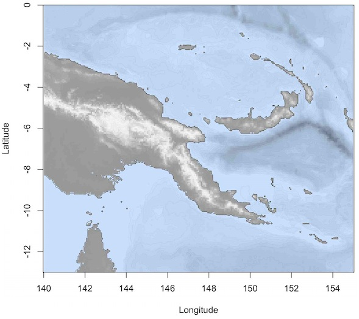
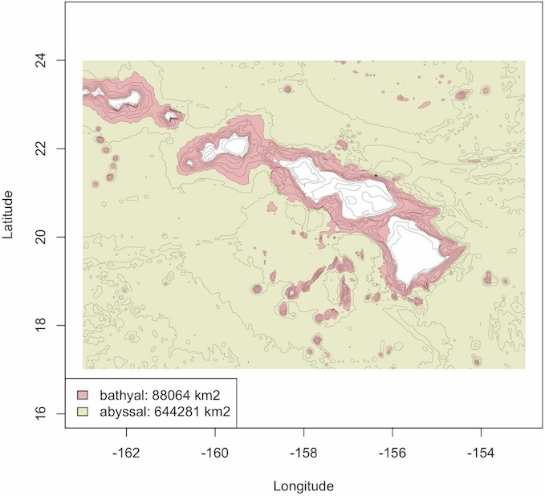
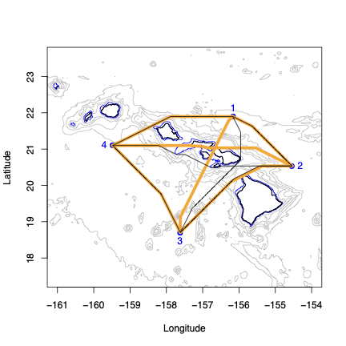
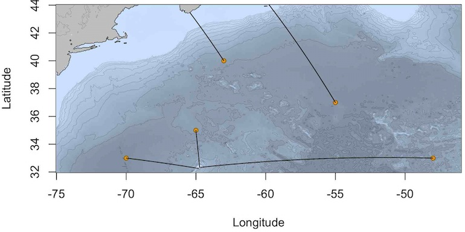
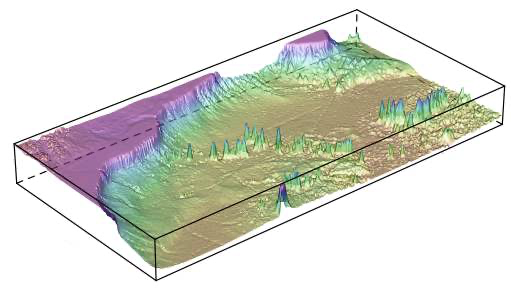
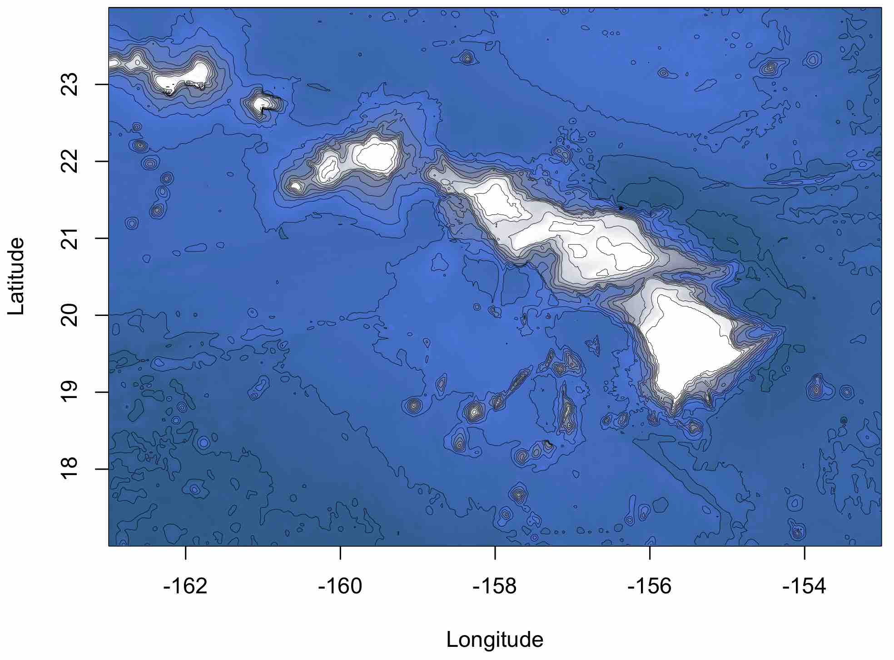
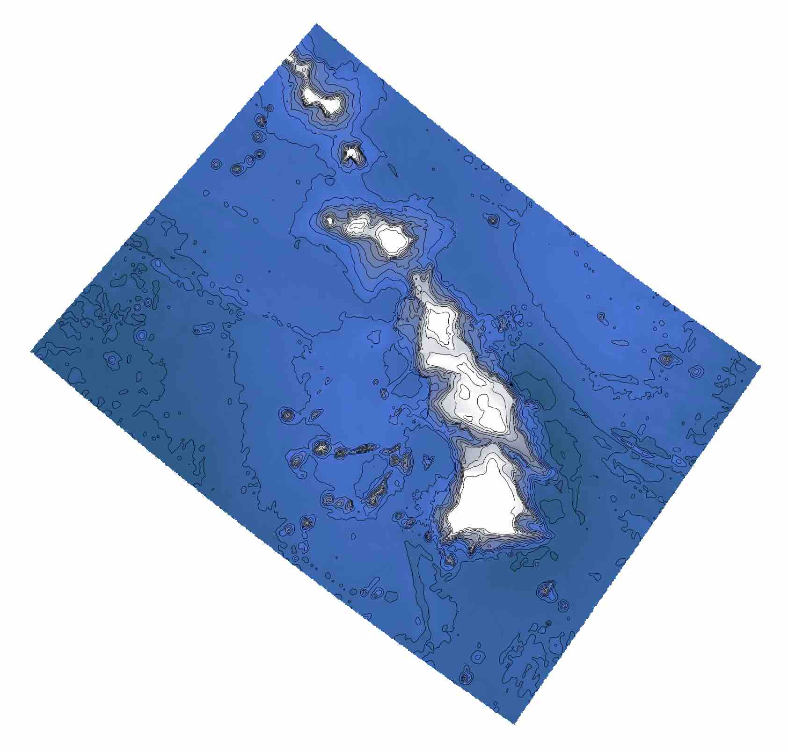
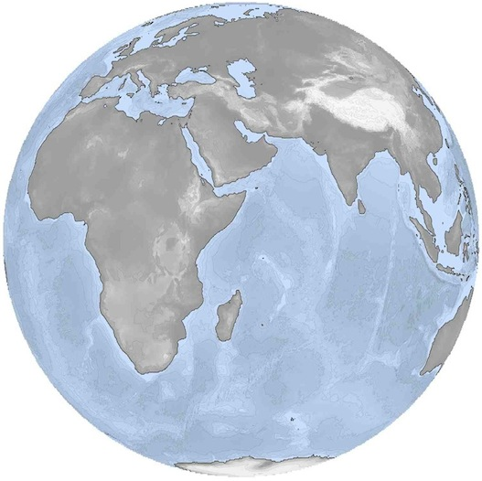

```{r}
#| label: setup
#| include: false
library(marmap2)
options(width = 60, continue = "  ")
```

## Extracting information from bathymetric data


### Depth and altitude along a transect or path.

Let's start by getting some data into R from the NOAA ETOPO 2022 database :

```{r, eval=FALSE, echo=TRUE}
library(marmap2)
papoue <- get_noaa(lon1 = 140, lon2 = 155,
			lat1 = -13, lat2 = 0, resolution = 4)
```


We can map these data using `plot()`:

```{r, echo=TRUE, eval=FALSE}
# Creating color palettes
blues <- c("lightsteelblue4", "lightsteelblue3",
           "lightsteelblue2", "lightsteelblue1")
greys <- c(grey(0.6), grey(0.93), grey(0.99))

plot(papoue, image = TRUE, land = TRUE, lwd = 0.03,
	bpal = list(c(0, max(papoue), greys),
	c(min(papoue), 0, blues)))

# Add coastline
plot(papoue, n = 1, lwd = 0.4, add = TRUE)
```


{width="100%"}


Basic information about the whole area can be displayed by `summary()`:

```{r}
summary(papoue)
```


We can use the `get_transect()` and `plot_profile()` functions to extract and plot a depth cross section from the `papoue` dataset. `get_transect()` will use the coordinates you input to calculate the coordinates and depths along your transect, and calculate the great circle distance separating each point along the transect from the point of origin (in kilometers).

```{r, fig.keep='none', echo=TRUE}
trsect <- get_transect(papoue, 150, -5, 153, -7, distance = TRUE)
head(trsect)
```


We can plot that information on a map and make a cross section plot with `plot_profile()`. By setting the `locator` option of `get_transect()` to `TRUE`, you can get transect information and make a cross-section plot directly by clicking on a bathemetric map.

```{r, echo=TRUE, fig.width=8, fig.height=4}
plot_profile(trsect)
```


The function `path_profile()` takes advantage of both `get_transect()` and `plot_profile()` to retrieve and plot bathymetric information along a path that is not limited to a straight transect between 2 points. See the help file of `plot_profile()` for more details.

### Getting information about points on a bathymetric map


The `get_depth()` function can be used to retrieve depth information by either clicking on the map or by providing a set of longitude/latitude pairs. This is helpfull to get depth information along a GPS track record for instance. If the argument `distance` is set to `TRUE`, the haversine distance (in km) from the first data point on will also be computed. The output will look like this:

```{r, eval=FALSE}
get_depth(papoue, distance = TRUE)

Waiting for interactive input: click any number of times
on the map, then press 'Esc'

       lon       lat  dist.km  depth
1 146.0200 -2.601702   0.0000   -758
2 147.6167 -1.844152 196.3933   -583
3 149.3193 -2.607345 366.4942  -2121
4 150.7295 -4.249027 553.8867  -2289
```


`get_sample()` can be used in combination with a table containing sampling information to retrieve sample information by clicking on the map. Let's make a fake table of sampling data and use it for plotting and use with `get_sample()`:

```{r, fig.keep='none', echo=TRUE}
x <- c(142.1390, 142.9593, 144.0466, 145.9141, 145.9372,
       146.0115, 145.9141, 146.8589, 146.6651, 147.1772,
       147.2856, 152.7475, 152.5025, 152.7816, 152.9010)
y <- c(-2.972065, -3.209449, -3.391399, -4.675720, -4.914153,
       -5.130116, -5.329641, -2.587792, -2.897221, -3.250368,
       -2.720080, -6.005769, -6.211152, -6.326915, -5.990206)

station <- paste("station", 1:15, sep = "")
sampling <- data.frame(x, y, station)
```


We have now created a small table that we can use for further analysis. Let's plot them on a map:

```{r, echo=-2}
head(sampling) # a preview of the first 6 lines of the dataset.
greys <- c(grey(0.6), grey(0.93), grey(0.99))

plot(papoue, image = TRUE, land = TRUE, n=1,
	bpal = list(c(0, max(papoue), greys),
	c(min(papoue), 0, blues)))

# add sampling points, and add text to the plot:
points(sampling$x, sampling$y, pch = 21, col = "black",
	bg = "yellow", cex = 1.3)
text(152, -7.2, "New Britain\nTrench", col = "white", font = 3)
```


By clicking on the map, we can select the area in the New Britain Trench, to get information on the sampling stations of that area. `get_sample()` will detect that there are samples in the area selected and return the locations of these samples.

```{r, eval=FALSE}
# click twice on the map to delimit an area:
get_sample(papoue, sampling, col.lon = 1, col.lat = 2)

          x         y   station
12 152.7475 -6.005769 station12
13 152.5025 -6.211152 station13
14 152.7816 -6.326915 station14
15 152.9010 -5.990206 station15
16 153.2314 -6.023344 station16
```


Instead of using a heat map to represent depth, we can use a simple contour plot for the bathymetry, add a color legend for the depth and associate the color of each point to the desired depth. First, let's get the depth associated with each sampling point in `sampling` using `get_depth()`:

```{r, echo=TRUE}
# Get the depth for each sampling point
sp <- get_depth(papoue, sampling[,1:2], locator = FALSE)
sp
```


Then, create a map, a color legend and add the sampling points:
```{r, echo=TRUE}
# create a contour plot for the bathymetry and add a scale
par(mai=c(1,1,1,1.5))
plot(papoue, lwd = c(0.3, 1), lty = c(1, 1),
     deep = c(-4500, 0), shallow = c(-50, 0), step = c(500, 0),
     col = c("grey", "black"), drawlabels = c(FALSE, FALSE))
scale_bathy(papoue, deg = 3, x = "bottomleft", inset = 5)

# set color palette for depth
library(shape)
mx <- abs(min(sp$depth, na.rm = TRUE))
col.points <- femmecol(mx)

# plot points and color depth scale
points(sp[,1:2], col = "black", bg = col.points[abs(sp$depth)],
	pch = 21, cex = 1.5)
colorlegend(zlim = c(mx, 0), col = rev(col.points),
            main = "depth (m)", posx = c(0.85, 0.88))
```


### Computation of projected surfaces

The function `get_area()` can be used to calculate projected surface areas (the projecting surface being the ocean surface). This functions depends on the `geosphere` package . For example, in the case of the Hawaiian Archipelago, we can calculate the surface area of the bathyal (1,000 to 4,000 m) and abyssal regions (4,000 to about 6,000 m).

```{r, fig.keep='none', echo=TRUE, eval=FALSE}
data(hawaii)
bathyal <- get_area(hawaii, level.inf = -4000, level.sup = -1000)
abyssal <- get_area(hawaii, level.inf = min(hawaii),
                    level.sup = -4000)
ba <- round(bathyal$Square.Km, 0)
ab <- round(abyssal$Square.Km, 0)
```


The function `get_area()` returns a list of 4 elements. The surface area in square kilometers (`Square.Km`), a matrix of zeros and ones delimiting the area of interest (`Area`) and 2 vectors (`Lon` and `$Lat`) containing the longitudes and latitudes of the area of interest. Such lists can be used to highlight the projected surfaces on an existing bathymetric map using function the `plot_area()`:

```{r, echo=TRUE, eval=FALSE}
plot(hawaii, lwd = 0.2)
col.bath <- rgb(0.7, 0, 0, 0.3)
col.abys <- rgb(0.7, 0.7, 0.3, 0.3)

plot_area(bathyal, col = col.bath)
plot_area(abyssal, col = col.abys)
```


Finally, we can add a legend with the calculated surface for both areas:

```{r, echo=TRUE, eval=FALSE}
legend(x="bottomleft",
	legend=c(paste("bathyal:",ba,"km2"),
	         paste("abyssal:",ab,"km2")),
	col="black", pch=21,
	pt.bg=c(col.meso,col.bath,col.abys))
```


{width="100%"}


## Computing distances

### Using bathymetric data for least-cost path analysis


`marmap` contains functions to facilitate least-cost path analysis that are based on the `raster`  and `gdistance`  packages. `gdistance` calculates routes in a heterogeneous landscape, taking obstacles into account. These obstacles can be defined in `marmap` based on bathymetric data. We will use the Hawaiian islands as our playground for this section.

```{r, fig.keep='none', echo=TRUE}
data(hawaii, hawaii.sites)
sites <- hawaii.sites[-c(1,4),]
rownames(sites) <- 1:4
```


We first compute a transition matrix to be used by `least_cost_distance()` to compute least cost distances between locations. The transition object generated by `transition_matrix()` contains the probability of transition from one cell of a bathymetric grid to adjacent cells, and depends on user defined parameters. `transition_matrix()` is especially usefull when least cost distances need to be calculated between several locations at sea. The default values for arguments `min.depth` and `max.depth` of `transition_matrix()` ensure that the path computed by `least_cost_distance()` will be the shortest path possible at sea avoiding land masses. The path can be constrained to a given depth range by setting manually `min.depth` and `max.depth`. For instance, it is possible to limit the possible paths to the continental shelf by setting `max.depth=-200`. Inaccuracies of the bathymetric data can occasionally result in paths crossing land masses. Setting `min.depth` to low negative values (e.g. -10 meters) can limit this problem.

Here, `trans1` is a transition object constrained only by land masses. `trans2` is a transition object that makes travel impossible in waters shallower than 200 meters depth. This step takes a little time.

```{r, eval=FALSE}
trans1 <- transition_matrix(hawaii)
trans2 <- transition_matrix(hawaii, min.depth = -200)
```


We can now use these transition objects to calculate least cost distances for `trans1` and `trans2`. The output of `least_cost_distance()` is a list of geographic positions corresponding to the least-cost path.

```{r, eval=FALSE}
out1 <- least_cost_distance(trans1, sites, res = "path")

|=================================================| 100%

out2 <- least_cost_distance(trans2, sites, res = "path")

|=================================================| 100%
```


We use the `lapply()` function to extract information from these lists and plot lines. Thick orange lines correspond to least-cost paths only constrained by landmasses. Thin black lines are paths constrained by the 200 m isobath. We store the result of `lapply()` in a `dummy` variable to avoid printing of unnecessary information. The coastline is in black, the 200 m isobath is in blue, and isobaths between 5000 and 200 m depth are in grey. Our sampling points are in blue.

```{r, eval=FALSE}
plot(hawaii, xlim = c(-161, -154), ylim = c(18, 23),
     deep = c(-5000, -200, 0), shallow = c(-200, 0, 0),
     col = c("grey", "blue", "black"), step = c(1000, 200, 1),
     lty = c(1, 1, 1), lwd = c(0.6, 0.6, 1.2),
     draw = c(FALSE, FALSE, FALSE))
points(sites, pch = 21, col = "blue", bg = color_to_alpha("blue", .9),
       cex = 1.2)
text(sites[,1], sites[,2], lab = rownames(sites),
     pos = c(3, 4, 1, 2), col = "blue")
lapply(out1, lines, col = "orange", lwd = 5, lty = 1) -> dummy
lapply(out2, lines, col = "black", lwd = 1, lty = 1) -> dummy
```

{width="100%"}


The argument `res` of `least_cost_distance()` controls whether path coordinates or distances between points (in kilometers) are outputted.  Let's see how these different scenarios (no constraint: great-circle distance, `dist0`~; avoid landmasses: `dist1`~; avoid areas shallower than 200 m: `dist2`) affect distances between sampling points:

```{r, eval=FALSE}
library(fossil)
dist0 <- round(earth.dist(sites), 0)
dist1 <- least_cost_distance(trans1, sites, res = "dist")
dist2 <- least_cost_distance(trans2, sites, res = "dist")

dist0

    1   2   3
2 226
3 387 381
4 355 517 331

dist1

    1   2   3
2 230
3 391 401
4 365 529 334

dist2

    1   2   3
2 230
3 423 403
4 365 533 334
```


Note: You can check out the help file for `least_cost_distance()` to see how we can combine these functions with cross-section calculations and plotting.

### Landscape Genetics


The distance objects created in the section above are formatted as matrices that can be used in `R` or exported to be used in GenePop , TESS , or other software. As an example, these distances can be used to perform a Mantel test, as implemented in the package `ade4` (`mantel.rtest()` function ; ). The matrices produced in `marmap` are ready for use with `ade4`. For export and use in external programs, the function `write.matrix()` of the `MASS` package  or `write.table()` of the `utils` package will be helpful.

### Shortest Great Circle Distances between points and isobath


Two functions of `marmap` allow for computing and plotting the shortest path following a great circle distance between a set of points on a map and an arbitrary isobath line. The function `distance_to_isobath()` depends on functions from packages `sp`  and `geosphere`  to compute the distances. By default (`isobath = 0`), the nearest location along the coastline is computed for each point.

```{r, echo=TRUE}
# Load NW Atlantic xyz data and convert to class bathy
data(nw.atlantic)
atl <- as_bathy(nw.atlantic)

# Create vectors of latitude and longitude for 5 points
lon <- c(-70, -65, -63, -55, -48)
lat <- c(33, 35, 40, 37, 33)

# Compute distances between each point and the nearest location
# along the coastline
d <- distance_to_isobath(atl, lon, lat, isobath = 0)
d
```


We can then plot the bathymetry, add the 5 points, and plot the great circle lines to the nearest points on the coast using the function `lines_gc()`:

```{r, echo=TRUE, eval=FALSE}
# Plot the bathymetry
plot(atl, image = TRUE, lwd = 0.1, land = TRUE,
     bpal = list(c(0, max(atl), "grey"), c(min(atl), 0, blues)))

# Make the coastline more visible
plot(atl, deep = 0, shallow = 0, step = 0, lwd = 0.6, add = TRUE)

# Add the 5 points
points(lon, lat, pch = 21, bg = "orange2", cex = 0.8)

# Add great circle lines
lines_gc(d[, 2:3], d[, 4:5])
```


{width="100%"}


The same process can be used to compute and visualize the shortest great circle distance between a set of points and any arbitrary isoline of depth or altitude by setting the `isobath` argument of `distance_to_isobath()` to non-zero values (the chosen value must be within the range of altitude/depth for the region used to compute the distances).

## 3D plotting


`R` contains tools to plot data in three dimensions. We can use the function `wireframe()` of the package `lattice`  to make a 3D representation of the NW Atlantic and its seamount chains. `wireframe()` is not part of `marmap`, and was therefore not meant to work with objects of class bathy. We need to use the function `unclass()` to make our data available to  `wireframe()`. Make sure to adjust the `aspect` option of `wireframe()`, to minimize vertical exaggeration and biased latitude / longitude aspect ratio.

```{r, eval=FALSE}
# Load NW Atlantic xyz data and convert to class bathy
data(nw.atlantic)
atl <- as_bathy(nw.atlantic)

library(lattice)
wireframe(unclass(atl), shade = TRUE, aspect = c(1/2, 0.1))
```


{width="100%"}


The `marmap` function `get_box()` can be coupled with the `lattice` function `wireframe()` to produce 3D plots of belt transects of given width. Let's use the NW Atlantic data to investigate these functions, and look at the New England and Corner Rise seamount chains.

```{r, echo=TRUE}
data(nw.atlantic)
atl <- as_bathy(nw.atlantic)

plot(atl, xlim = c(-70, -52),
     deep = c(-5000, 0), shallow = c(0, 0), step = c(1000, 0),
     col = c("lightgrey", "black"), lwd = c(0.8, 1),
     lty = c(1, 1), draw = c(FALSE, FALSE))

belt <- get_box(atl, x1 = -68.6, x2 = -53.7, y1 = 42.4, y2 = 32.5,
                width = 3, col = "red")
```

```{r, echo=TRUE}
library(lattice)
wireframe(belt, shade = TRUE, zoom = 1.1,
      aspect = c(1/4, 0.1),
      screen = list(z = -60, x = -55),
      par.settings = list(axis.line = list(col = "transparent")),
      par.box = c(col = rgb(0, 0, 0, 0.1)))
```


## Working with big files


Data files containing bathymetry information can rapidely become huge (*e.g.* tens to hundreds of Mega-octets, millions of latitude-longitude-depth/altitude triplets), especially for hi-resolution bathymetry data recorded over large areas. If `marmap` can usually import large xyz files^[The netcdf format is especially useful when dealing with big bathymetric files. Importing netcdf files to work with `marmap` is discussed in the `marmap-import-export` vignette.] to create `bathy` objects using `read_bathy()`, working with such objects can be difficult (if not impossible) depending on the amount of RAM available on your computer. More specifically, ressource-intensive tasks such as computing least cost paths might be extremely time consumming with datasets of millions of points. Even plotting with `plot()` can be very slow when too many countour lines are used, or when `image` is set to `TRUE`. In such situations, it is very useful to subset a big `bathy` object by either:


- selecting a smaller region of a large `bathy` object while conserving its full resolution
- lowering the resolution of the `bathy` object over the whole area
- a combination of the first 2 options, *i.e.* decreasing the resolution of the `bathy` object and selecting a smaller area for plotting or for other ressource-intensive computations.


For option 1, you can either use `get_box()` (see above), or `subset_bathy()` to select a smaller area of a large `bathy` object. `subset_bathy()` allows the selection of a non-rectangular area within a large `bathy` object to create a new, smaller `bathy` object of the same resolution. This function also has an interactive mode so that you can select an area of interest by clicking on a map.

For option 2, there is no built-in solution in `marmap`. However, it is pretty straightforward to decrease the resolution of a `bathy` object since it is just a `matrix` with a special `class`. If you have a big `bathy` object called `dat`, here is a solution:

```{r, eval=FALSE}
# Derease the resolution of dat by a factor n
n <- 2
dat.lowres <- dat[seq(1, nrow(dat), by = n),
                  seq(1, ncol(dat), by = n)]

# Specify the class of the new object
class(dat.lowres) <- "bathy"
```


`dat.lowres` is now a new `bathy` object with a resolution 2 times lower than it was for `dat`.

Option 3 is just a combination of the 2 previous methods: first, create a `dat.lowres` object, then use `get_box()` or `subset_bathy()` to extract a smaller region out of it.


## Interactions with other packages, projections


`marmap` interacts with multiple existing `R` packages for visualization and analysis, such as `lattice` for building three-dimensional plots, and `gdistance` for least-cost path calculations (see above). `marmap` also contains functions to ease interactions with other packages dedicated to the analysis of spatial data. Data of class `bathy` can be transformed into `RasterLayer` objets for use in the `raster` package  or into `SpatialGridDataFrame` objects for use in the packages `sp` . The full range of spatial analyses implemented in packages taking advantage of these classes are thus available for bathymetric data. The simple examples presented below illustrate how to apply an arbitrary projection to `bathy` objects using the function `projectRaster()` from the `raster` package (n.b. a working installation of the `rgdal` package is needed to use this function).

```{r, eval=FALSE}
library(raster)

# Loads data of class bathy
data(hawaii)

# Creates an object of class raster
r1 <- marmap::as_raster(hawaii)

# Defines the target projection
newproj <- "+proj=lcc +lat_1=48 +lat_2=33 +lon_0=-100
            +ellps=WGS84"

# Creates a new projected raster object
r2 <- projectRaster(r1, crs = newproj)

# Switches back to a bathy object
hawaii.projected <- as_bathy(r2)

# Plots both the original and projected bathy objects
plot(hawaii, image = TRUE, lwd = 0.3)
plot(hawaii.projected, image = TRUE, lwd = 0.3,
     xlab = "", ylab = "", axes = FALSE)
```


{width="100%"}


{width="100%"}


Here is another example for an orthographic projection of the whole world:

```{r, eval=FALSE}
library(raster)

# Get data for the whole world. Careful: ca. 21 Mo!
world <- get_noaa(-180, 180, -90, 90, res = 15, keep = TRUE)

# Switch to raster
world.ras <- marmap::as_raster(world)

# Set the projection and project
my.proj <-   "+proj=ortho +lat_0=0 +lon_0=50 +x_0=0 +y_0=0"
world.ras.proj <- projectRaster(world.ras,crs = my.proj)

# Switch back to a bathy object
world.proj <- as_bathy(world.ras.proj)

# Set colors for oceans and land masses
blues <- c("lightsteelblue4", "lightsteelblue3",
           "lightsteelblue2", "lightsteelblue1")
greys <- c(grey(0.6), grey(0.93), grey(0.99))

# And plot!
plot(world.proj, image = TRUE, land = TRUE, lwd = 0.05,
     bpal = list(c(0, max(world.proj, na.rm = T), greys),
                 c(min(world.proj, na.rm = T), 0, blues)),
     axes = FALSE, xlab = "", ylab = "")

plot(world.proj, n = 1, lwd = 0.4, add = TRUE)
```


{width="100%"}


A great list of available projections is available at <http://www.remotesensing.org/geotiff/proj_list/>


## References

- 
NOAA National Centers for Environmental Information (2022) {ETOPO 2022 15 Arc-Second Global Relief Model}.
  NOAA National Centers for Environmental Information. <https://doi.org/10.25921/fd45-gt74>
- 
Bivand RS, Pebesma EJ, Gomez-Rubio V (2013) {{A}pplied spatial data analysis with {R}, {S}econd edition}.
  Springer, NY.
- 
Chessel D, Dufour A, Thioulouse J (2004) {The ade4 package -I- One-table methods}.
  R News 4: 5-10.
- 
Deepayan S, (2008) {Lattice: Multivariate Data Visualization with R}.
  Springer, New York.
- 
Dray S, Dufour A, Chessel D (2007) {The ade4 package-II: Two-table and K-table methods}.
  R News 7: 47-52.
- 
Dray S, Dufour A (2007) {The ade4 package: implementing the duality diagram for ecologists}.
  Journal of Statistical Software 22: 1-20.
- 
Durand E, Jay F, Gaggiotti OE, François O (2009) Spatial inference of admixture proportions and secondary contact zones.
  Molecular Biology and Evolution 26: 1963-1973.
- 
van Etten J (2014) {gdistance: distances and routes on geographical grids}.
  <http://CRAN.R-project.org/package=gdistance>.
  R package version 1.1-5.
- 
Hijmans RJ (2014) {geosphere: Spherical Trigonometry}.
  <http://CRAN.R-project.org/package=geosphere>.
  R package version 1.3-11.
- 
Hijmans RJ (2014) {raster: Geographic data analysis and modeling}.
  <http://CRAN.R-project.org/package=raster>.
  R package version 2.3-0.
- 
James DA, Falcon S (2013) {RSQLite: SQLite interface for R}.
  <http://CRAN.R-project.org/package=RSQLite>.
  R package version 0.11.4.
- 
{NOAA National Geophysical Data Center}.
  {GEODAS Grid Translator - Design a grid}.
  <http://www.ngdc.noaa.gov/mgg/gdas/gd_ designagrid.html>.
- 
Pante E, Simon-Bouhet B (2013) {marmap: A Package for Importing, Plotting and Analyzing Bathymetric and Topographic Data in R.}
  PLoS ONE 8:e73051
- 
Pebesma EJ, Bivand RS (2005) {Classes and methods for spatial data in R}.
  R News. 5:9-13.
- 
Rousset F, (2008) GENEPOP'007: a complete re-implementation of the genepop software for Windows and Linux.
  Molecular Ecology Resources 8: 103-106.
- 
Venables WN, Ripley BD (2002) {Modern Applied Statistics with S. Fourth edition}.
  Springer, NY.
