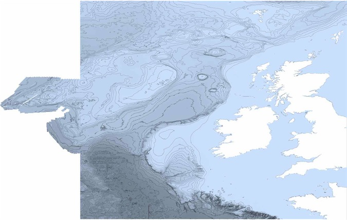

```{r}
#| label: setup
#| include: false
library(marmap2)
options(width = 60, continue = "  ")
```

## Overview of the different import and export strategies available in `marmap`


`get_noaa()` is the easiest way to load data into `R`, but it depends on the NOAA download protocol, and one must have an internet connection. However, setting the `keep` argument to `TRUE` will save on disk the data downloaded from the NOAA servers when the function is called for the first time. Any subsequent call to `get_noaa()` with the same list of arguments (*i.e.* same longitudes, latitudes and resolution) will preferentially load the dataset saved on disk in the current working directory. This allows the users to run scripts without having to query the NOAA servers and download the same data again and again, making the use of `get_noaa()` possible even off-line. `read_bathy()` allows import of data into `R`, and this data can be located on a drive ; an internet connection is therefore not mandatory. This is a good way to import data that have been saved locally on your drive, and may be faster than re-downloading data from the NOAA server at the beginning of each `R` session. If the user is building maps routinely, we propose two functions to create a local database that can be accessed from within `R`. These functions are `set_sql()` and `subset_sql()`. 

| Function | Job | Input | Output | Internet |
|---|---|---|---|---|
| `get_noaa()` | Downloads data from NOAA servers | Coordinates of bounding box and resolution | Data matrix of class `bathy` | yes |
| `read_gebco_bathy()` | Imports data from a GEBCO file | External NetCDF file | Data matrix of class `bathy` | no |
| `read_bathy()` | Imports xyz data | External xyz file | Data matrix of class `bathy` | no |
| `set_sql()` | Creates a local SQL database | External xyz file | SQL database | no |
| `subset_sql()` | Queries a local SQL database | Bounding box and resolution | Data matrix of class `bathy` | no |
| `as_xyz()` | Converts `bathy` to xyz | `bathy` object | xyz table | no |
| `as_bathy()` | Converts xyz or raster to `bathy` | xyz table or raster object | `bathy` object | no |


## Importing bathymetric data from GEBCO


`read_gebco_bathy()` provides a data source alternative to the NOAA-hosted ETOPO1 data . The GEBCO data, hosted on the British Oceanographic Data Center server (<http://www.gebco.net>), is available at the 30 second and 1 minute resolutions. Both types can be imported using `read_gebco_bathy()`, using the `ncdf4` package  to load netCDF data into `R`. A third database type, GEBCO_08 SID, is available from the website. This database contains a Source IDentifier (SID) specifying which grid cells have depth information based on soundings; it does not contain bathymetry or topography data. The function `read_gebco_bathy()` can read this type of database as well, and only the SID information will be included in the object of class `bathy`. Therefore, to display a map with both the bathymetry and the SID information, you will have to download both datasets from GEBCO, and import and plot both independently. Here is an example for the region of the Mediterranean Sea including Corsica and Sardinia:

```{r, eval=FALSE}
# the bathymetry data
med <- read_gebco_bathy("gebco_08_7_38_10_43_corsica.nc")
summary(med)

# the SID data
sid <- read_gebco_bathy("gebco_SID_7_38_10_43_corsica.nc")
summary(sid)

# a pretty custom color palette
blues <- colorRampPalette(c("lightblue", "cadetblue2",
                            "cadetblue1", "white"))

# a first plot for bathymetry
plot(med, n = 1, image = TRUE, bpal = blues(100), main =
     "Corsica & Sardinia bathymetry\n GEODAS 08 & SID datasets")

# a second layer with the SID data
contour(as.numeric(rownames(sid)), as.numeric(colnames(sid)),
      sid, drawlabels = FALSE, lwd = 0.1, add = TRUE)
```


Because the resolution of GEBCO data is rather fine, we offer the possibility of downsizing the dataset with the `resolution` argument of `read_gebco_bathy()`. This argument specifies the resolution of the object of class `bathy` the user gets after importing GEBCO data in `R`. `resolution` is in units of the selected database: in ``GEBCO_1min'', `resolution` is in minutes; in ``GEBCO_08'', `resolution` is in 30 arcseconds (that is, `resolution = 3` corresponds to 3 times 30 sec, or 1.5 arcminute resolution).

## Other sources of netcdf files


One of the most widely used format for georeferenced data is netcdf. Bathymetric data is often presented as netcdf files since it is a compact, self-describing, machine-independent data format especially usefull for large scale and/or high resolution gridded data. For instance, the European Marine Observation and Data Network (emodnet: <http://www.emodnet.eu/bathymetry>) makes bathymetric data publicly available for most european waters. Among other formats, netcdf files of bathymetry for large regions (*e.g.* Bay of Biscay and Iberian coasts, Celtic Seas, Greater North Sea...) are available for download. `marmap` does not offer an automated way to import such files since almost every netcdf file is unique. However, a small number of very simple steps make it possible to import netcdf files and transform them to `bathy` objects. Here is an example with the `Celtic Seas.mnt` file downloaded on the emodnet website:

```{r, eval=FALSE}
# Load relevant packages
library(marmap2) ; library(ncdf4)

# Load the netcdf file into R using the ncdf4 package
nc <- nc_open("Celtic Seas.mnt")

# Print the content of the file
nc

[1] "file Celtic Seas.mnt has 9 dimensions:"
[1] "CIB_BLOCK_DIM   Size: 1024"
[1] "mbHistoryRecNbr   Size: 20"
[1] "mbNameLength   Size: 20"
[1] "mbCommentLength   Size: 256"
[1] "mbLabelLength   Size: 40"
[1] "LAYERS_HEADERS   Size: 20"
[1] "LINES   Size: 3840"
[1] "COLUMNS   Size: 6120"
[1] "mbCDILength   Size: 100"
[1] "------------------------"
[1] "file Celtic Seas.mnt has 17 variables:"
[1] "int mbHistDate[mbHistoryRecNbr]
          Longname:History date Missval:2147483647"
[1] "int mbHistTime[mbHistoryRecNbr]
          Longname:History time (UT) Missval:NA"
[1] "byte mbHistCode[mbHistoryRecNbr]
          Longname:History code Missval:0"
[1] "char mbHistAutor[mbNameLength,mbHistoryRecNbr]
          Longname:History autor Missval:NA"
[1] "char mbHistModule[mbNameLength,mbHistoryRecNbr]
          Longname:History module Missval:NA"
[1] "char mbHistComment[mbCommentLength,mbHistoryRecNbr]
          Longname:History comment Missval:NA"
[1] "char Layer_name[mbNameLength,LAYERS_HEADERS]
          Longname:Nom de la couche Missval:NA"
[1] "short DEPTH[COLUMNS,LINES]
          Longname:DEPTH Missval:32767"
[1] "short SMO_DEPTH[COLUMNS,LINES]
          Longname:SMO_DEPTH Missval:32767"
[1] "int OFF_DEPTH[COLUMNS,LINES]
          Longname:OFF_DEPTH Missval:2147483647"
[1] "int VSOUNDINGS[COLUMNS,LINES]
          Longname:VSOUNDINGS Missval:2147483647"
[1] "short MIN_SOUNDING[COLUMNS,LINES]
          Longname:MIN_SOUNDING Missval:32767"
[1] "short MAX_SOUNDING[COLUMNS,LINES]
          Longname:MAX_SOUNDING Missval:32767"
[1] "short STDEV[COLUMNS,LINES]
          Longname:STDEV Missval:32767"
[1] "char CDI[mbCDILength,COLUMNS,LINES]
          Longname:CDI Missval:NA"
[1] "byte CELL_NUMBER[COLUMNS,LINES]
          Longname:CELL_NUMBER Missval:127"
[1] "int CDI_SOUNDINGS[COLUMNS,LINES]
          Longname:CDI_SOUNDINGS Missval:2147483647"
```


Here, we see that a table called `DEPTH` is available and that its dimensions are `[COLUMS,LINES]` (*i.e.* 6120 rows and 3840 columns). Extracting these data to create a `bathy` object is as simple as:

```{r, eval=FALSE}
celt <- ncvar_get(nc, "DEPTH")
colnames(celt) <- ncvar_get(nc, "LINES")
rownames(celt) <- ncvar_get(nc, "COLUMNS")
class(celt) <- "bathy"
```


`celt` is now an object of class `bathy` on which we can use any `marmap` function, even if missing data are present. Here is the plot of this `bathy` object of more than 23.5 million cells:

```{r, eval=FALSE}
# Custom color palette
blues <- colorRampPalette(c("lightsteelblue4", "lightsteelblue3",
                            "lightsteelblue2", "lightsteelblue1"))

# Map
plot(celt, image = TRUE, bpal = blues(100), lwd = 0.1)
```


{width="100%"}


This map appears slightly blurred here since we had to reduce the image quality to produce this vignette. The quality of the original map produced in `R` is much higher. Since the emodnet files have a resolution of 15 seconds, producing a map at such a large scale is time consumming. We thus recommend reading the ``Working with big files'' section of the `marmap-data-analysis` vignette for strategies to deal with such big datasets.

## Getting bathymetric data from an xyz file


`read_bathy()` will read xyz data from any source. It can import bathymetric data for non rectangular areas or with lots of missing data as is often the case for custom datasets acquired by various types of sonar systems (*e.g.* Multibeam Echo Sounders). Alternatively, xyz files can be imported in `R` using `read.table()` and transformed to `bathy` objects with `as_bathy()`. Here, we will get ETOPO1 data  hosted on the NOAA GEODAS server . To get the data, use the following link: <http://www.ngdc.noaa.gov/mgg/gdas/gd_designagrid.html>.

To prepare data from NOAA, give a name to your custom grid, choose the database (ETOPO1 1-minute Global Relief), fill the custom grid form (upper latitude: 0, lower latitude: 13S, left longitude: 140E, right longitude: 155E) for a grid cell size of 10 minute, and choose ``XYZ (lon,lat,depth)'' as the ``Output Grid Format'', ``No Header'' as the ``Output Grid Header'', and either of the space, tab of comma as the column delimiter (either can be used, but ``comma'' is the default import format of `read_bathy()`). Choose ``omit empty grid cells'' to reduce memory usage. Submit your job, and retrieved your data. You will get a zipped folder, in which you will find (in a subfolder) a .xyz  file with your data. Place it, for example, in your work folder.

The resolution of 10 minutes is a low resolution that will keep the size of the example file small, about 200 kb. Increasing the resolution to 1 minute would result in a file size of about 20 mb.

Launch `R`. Navigate to your working directory (for example, with `setwd()`). Then laod the `marmap` package  with `library(marmap2)` and your xyz data (we will call it `png.xyz`) with `read_bathy()`. This converts your data into an `R` object of `class bathy`. `summary()` helps you check the data ; because `bathy` is a `class`, and `R` an object-oriented language, you just have to use `summary()`, because `R` will recognize that you are feeding `summary()` an object of `class bathy`. This is also true for `plot()` and `plot()`.

```{r, fig.keep='none', echo=TRUE}
library(marmap2)
papoue <- read_bathy('png.xyz', header = FALSE, sep = "\t")
summary(papoue)
```


## Getting bathymetric data from NOAA: local SQL data{-}base


`set_sql()` and `subset_sql()` create and query a local SQL database for bathymetric data. These tools are made for routine use with no internet connection. The full ETOPO1 database, or a subset (for example), can be downloaded on your computer, and used to set an SQL database, which size will be approximately the same as your original xyz data (unzipped ETOPO1 is about 5 Go). The advantage of SQL, a language for querying large databases, are manyfold. Its use will allow rapid upload of data into `R`, directly as `bathy` objects (and therefore directly useable for plotting and analysis) with a smaller footprint on your memory than if you tried to load a very large xyz file into `R` and then subset-ed it. Here is a simple example on how to set up and use an SQL database for `marmap`.

Use a local file with xyz data (we can re-use the `png.xyz` that we created above for use with `read_bathy()`), and submit it to `set_sql()`. Make sure that no file called `bathy_db` is present in your working directory (since we will use the default value for the `db.name` argument of `set_sql` and `subset_sql`).

```{r, fig.keep='none', echo=TRUE}
set_sql(bathy = "png.xyz", header = FALSE, sep = "\t")
```


This will created a file `bathy_db` in your working directory, which size is about the size of (or larger than) your original data. If you want to create a database for frequent use, you just need to do this once. `subset_sql()` will know where to get the data in future R sessions. If `set_sql()` worked properly, it will return `TRUE`. If there is a problem (e.g. database connection already open, database file already created ...) it will return `FALSE`.  Lets query a subset of the png dataset, and check that it is indeed what we asked for with the `summary()` function:

```{r, fig.keep='none', echo=TRUE}
test <- subset_sql(min_lon = 145, max_lon = 150,
                  min_lat = -2, max_lat = 0)
summary(test)
```


Finally, when you are done with the SQL dataset, you can remove it with:

```{r, fig.keep='none', echo=TRUE, eval=FALSE}
system("rm bathy_db")
```


## References

- 
Amante C, Eakins BW (2009) Etopo1 1 arc-minute global relief model: Procedures, data sources and analysis.
  NOAA Technical Memorandum NESDIS NGDC-24: 1-19.
- 
James DA, Falcon S (2013) {RSQLite: SQLite interface for R}.
  <http://CRAN.R-project.org/package=RSQLite>.
  R package version 0.11.4.
- 
{NOAA National Geophysical Data Center}.
  {GEODAS Grid Translator - Design a grid}.
  <http://www.ngdc.noaa.gov/mgg/gdas/gd_ designagrid.html>.
- 
Pante E, Simon-Bouhet B (2013) {marmap: A Package for Importing, Plotting and Analyzing Bathymetric and Topographic Data in R.}
  PLoS ONE 8:e73051
- 
Pierce D (2015) {ncdf4: Interface to Unidata netCDF (Version 4 or Earlier) Format Data Files}.
  <http://CRAN.R-project.org/package=ncdf4>
  R package version 1.14.
