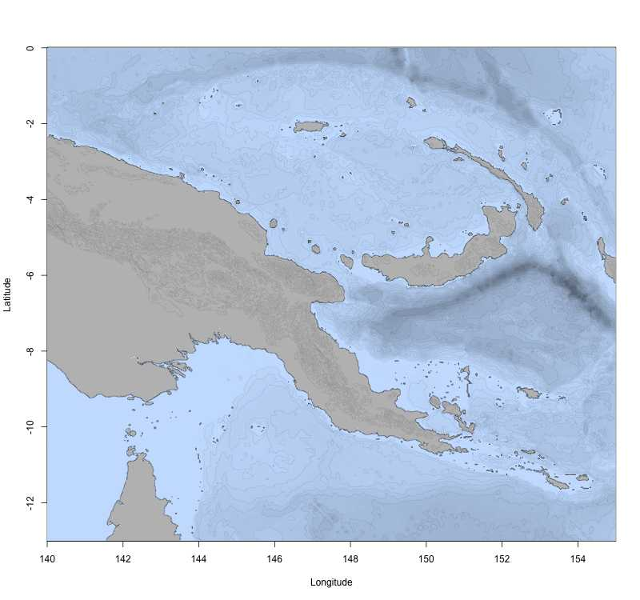
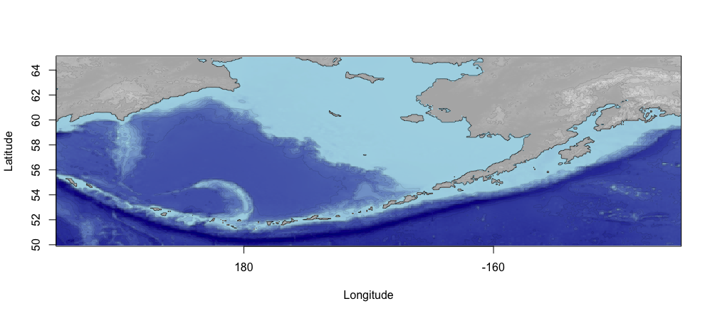
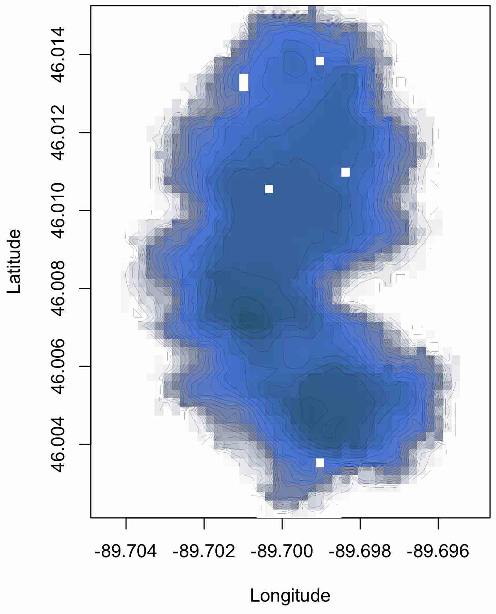

```{r}
#| label: setup
#| include: false
library(marmap2)
options(width = 60, continue = "  ")
```

## Introduction


In this vignette we introduce `marmap` , a package designed for manipulating bathymetric data in R. `marmap` uses simple latitude-longitude-depth data in ascii format and takes advantage of the advanced plotting tools available in R to build publication-quality bathymetric maps. Functions to query data (bathymetry, sampling information...) directly by clicking on `marmap` maps are available. Bathymetric and topographic data can also be used to constrain the calculation of realistic shortest path distances. Such information can be used in molecular ecology, for example, to evaluate genetic isolation by distance in a spatially-explicit framework.

## A quick tutorial


In this tutorial, we will import publicly available data and produce bathymetric maps of Papua New Guinea.

### Getting data into R


Launch R. Navigate to your working directory (for example, with `setwd()`). Then launch the `marmap` package. The simplest way to get bathymetric data into R for use with `marmap` is to use the `get_noaa()` function. It queries the ETOPO 2022 dataset  hosted on the NOAA server, based on coordinates and a resolution given by the user (please note that this function depends on the availability of the NOAA server). In one line, we can get the data into R and start plotting:

```{r, eval=FALSE, echo=TRUE}
library(marmap2)
papoue <- get_noaa(lon1 = 140, lon2 = 155,
			lat1 = -13, lat2 = 0, resolution = 10)
```


When the argument `keep` (defaults to `FALSE`) is set to `TRUE`, the downloaded data are saved into a file within your current working directory. If an identical query is performed several times (*i.e.* using identical latitudes, longitudes and resolution), `get_noaa()` will load data from the file previously written to the disk instead of querying the NOAA database again. This behavior should be used preferentially to reduce the number of uncessary queries to the NOAA website and to reduce data load time.

`summary()` helps you check the data ; because `bathy` is a class, and R an object-oriented language, you just have to use `summary()`. R will recognize that you are feeding `summary()` an object of class `bathy`. This is also true for `plot()` and `plot()`.

```{r, echo=TRUE}
summary(papoue)
```


### Plotting bathymetric data


We can now use `plot()` to map the data. You can see that the 10 minute resolution is a bit rough, but enough to demonstrate how `marmap` works (to increase the resolution, simply decrease the value for the `resolution` argument).

```{r, echo=TRUE}
plot(papoue)
```


We can now use some of the options of `plot()` to make the map more informative. First, we can plot a heat map, using the built in color palette. We can also add a scale in kilometers.

```{r, echo=TRUE}
plot(papoue, image = TRUE)
scale_bathy(papoue, deg = 2, x = "bottomleft", inset = 5)
```


The `bpal` options allows you to use a custom color palette, which can be easily prepared with the R function `colorRampPalette()`. We store the color ramp in the object called `blues`, and when we call it in `plot()`, we specify how many colors need to be used in the palette (here 100).

```{r, echo=TRUE}
blues <- colorRampPalette(c("red","purple","blue",
                            "cadetblue1","white"))
plot(papoue, image = TRUE, bpal = blues(100))
```


For maps using the `image` option of `plot()`, you might see that the PDF rendering of your map is slightly different from the way it looks in R: the small space between cells becomes visible. This is probably due to the way your system handles PDFs. A simple way around this phenomenon is to export the map in a raster (rather than vector) format. You can use the `tiff()`, `jpeg()`, `bmp()` or `png()` functions available in R.

This map looks a little crowded ; let's dim the isobaths (dark grey color and lighter line width), and strengthen the coastline (black color and thicker line width). The deepest isobaths will be hard to see on a dark blue background ; we can therefore choose to plot these in light grey to improve contrast. The option `drawlabel` controls whether isobath labels (e.g. ``-3000'') are plotted or not.

```{r, echo=TRUE}
plot(papoue, image = TRUE, bpal = blues(100),
     deep = c(-9000, -3000, 0),
     shallow = c(-3000, -10, 0),
     step = c(1000, 1000, 0),
     lwd = c(0.8, 0.8, 1), lty = c(1, 1, 1),
     col = c("lightgrey", "darkgrey", "black"),
     drawlabel = c(FALSE, FALSE, FALSE))
```


The `bpal` argument of `plot()` also accepts a list of depth/altitude slices associated with a set of colors for each slice. This method makes it possible to easily produce publication-quality maps. For instance, using the `papoue` dataset downloaded at full resolution (*i.e.* with the `resolution` argument of the `get_noaa()` function set to 1) we can easily produce a high-resolution map:

```{r, echo=TRUE, eval=FALSE}
# Creating a custom palette of blues
blues <- c("lightsteelblue4", "lightsteelblue3",
           "lightsteelblue2", "lightsteelblue1")

# Plotting the bathymetry with different colors for land and sea
plot(papoue, image = TRUE, land = TRUE, lwd = 0.1,
     bpal = list(c(0, max(papoue), "grey"),
                 c(min(papoue),0,blues)))

# Making the coastline more visible
plot(papoue, deep = 0, shallow = 0, step = 0,
     lwd = 0.4, add = TRUE)
```


{width="100%"}


### Preparing maps in the Pacific antimeridian region


The antimeridian (or antemeridian) is the 180th meridian and is located about in the middle of the Pacific Ocean, east of New Zealand and Fidji, west of Hawaii and Tonga. If you want to prepare a map of the Aleutian Islands (Alaska), your longitude values may, for example, go from 165 to 180 degrees East, and 180 to 165 degrees West. Crossing the antemeridian means that you will need to download data for the eastern (165 to 180) and the western (-180 to -165) portions of the area of interest. For example, if you try to download bathymetric data for the Aleutians in one step on the GEBCO website (<http://www.gebco.net>), an error message tells you ``The Westernmost is more Easterly than the Easternmost. Please amend your search query''. 
`get_noaa()` has an argument to deal with the antemeridian region. For the Aleutians, you would use the `antimeridian` argument. `summary()` can interpret antimeridian areas as well. When you plot your antimeridian region, the default behavior of `plot()` is to scale longitudes from 0 to 360 degrees (170E to 170W would be displayed as 170, 190 instead of 170, -170). You can use the argument `axes=FALSE` in `plot()` and add correct labels with `antimeridian_box()`. We have set the default behavior of `plot()` in this way to remind the user that the scale of the bathy object, in the antimeridian region, goes from 0 to 360; if you need to plot points on the map, you need to take this into account (*i.e.* a point at -170 longitude must be plotted using -170 + 360 = 190, not 170 nor -170).

```{r, eval=FALSE}
aleu <- get_noaa(165, -145, 50, 65, resolution = 5,
                      antimeridian = TRUE)
plot(aleu, image = TRUE, land = TRUE, axes = FALSE, lwd=0.1,
     bpal = list(c(0, max(aleu), grey(.7), grey(.9), grey(.95)),
                 c(min(aleu), 0, "darkblue", "lightblue")))
plot(aleu, n = 1, lwd = 0.5, add = TRUE)
antimeridian_box(aleu)
```


{width="100%"}


```{r}
summary(aleu)
```


Alternatively, it is possible to import two compatible `bathy` objects (for instance from GEBCO), one for the eastern part and one for the western part of the area of interest. The function `collate_bathy()` takes care of the stitching process: relabelling longitudes in the 0-360 degrees range, removing duplicated data (*i.e.* the data for longitude 180 is often present once in each individual dataset and thus needs to be removed once), etc. Providing that we downloaded two files `east.nc` and `west.nc` from the GEBCO website, creating a proper bathy object for the antimeridian region is as simple as:

```{r, eval=FALSE}
a <- getGEBCO.bathy("east.nc")
b <- getGEBCO.bathy("west.nc")
stitched <- collate_bathy(a,b)
```


### Irregularly-spaced data


From the ground up, `marmap` was built to work with data fitting in regularly spaced grids, such as the global bathymetric databases hosted on the NOAA or GEBCO servers. However, it is not uncommon to get custom xyz data that do not fit in such grids. See for instance this dataset modified from a dataset kindly provided by Noah Lottig from the University of Wisconsin (<http://limnology.wisc.edu/personnel/lottig/>):

```{r}
data(irregular)
head(irregular)
plot(irregular$lon, irregular$lat, pch = 19, cex = 0.3, asp = 1)
```


Using several functions from the `raster` package, we provide an easy way to transform such irregularly-spaced xyz data into a regularly-spaced grid. First, we transform the original data into a raster object of user-defined dimensions:

```{r, griddify}
reg <- griddify(irregular, nlon = 40, nlat = 60)
class(reg)
```


Then, we transform this object into a `bathy` object for easy plotting:

```{r, fig.keep='none'}
bat <- as_bathy(reg)
class(bat)

# Plot the new bathy object
plot(bat, image = TRUE, lwd = 0.1)
```


{width="100%"}


The resulting `bathy` object can contain either:
- empty cells (*i.e.* cells containing `NAs`) when none of the original data points fall within a given cell,
- the mean of the original depth/altitude values for cells containing more than one original value,
- or the value of the original dataset when exactly 1 point falls within a given cell.

A bilinear smoothing is then applied in order to try to fill most empty cells. The `nlon` and `nlat` arguments of `griddify()` are thus of critical importance in order to limit the number of empty cells in the resulting `bathy` object.

## Further reading


Other vignettes are available for `marmap`. To get more information about data import and export strategies, or to learn about the capabilities of `marmap` to analyse bathymetric data, please check the other vignettes:

```{r, eval=FALSE}
vignette("marmap-ImportExport")
vignette("marmap-DataAnalysis")
```


## References

- 
NOAA National Centers for Environmental Information (2022) {ETOPO 2022 15 Arc-Second Global Relief Model}.
  NOAA National Centers for Environmental Information. <https://doi.org/10.25921/fd45-gt74>
- 
Pante E, Simon-Bouhet B (2013) {marmap: A Package for Importing, Plotting and Analyzing Bathymetric and Topographic Data in R.}
  PLoS ONE 8:e73051
